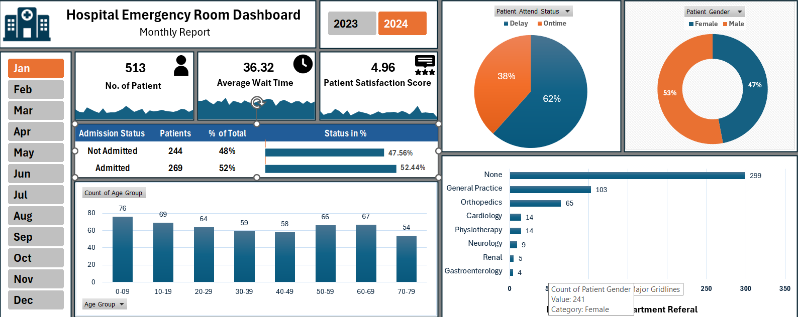

# 🏥 Hospital Emergency Room Analysis Dashboard (Excel)

This project is an end-to-end Excel dashboard built to analyze the performance and efficiency of a hospital emergency room. It enables stakeholders to make data-driven decisions through visual insights, key metrics, and clean data structuring—all developed entirely in Microsoft Excel.

---

## 🎯 Project Purpose

To improve emergency room efficiency and decision-making by:

- Visualizing key healthcare metrics
- Identifying trends in patient demographics and service times
- Supporting hospital management in resource planning

---

## 📊 Key Metrics (KPIs)

The dashboard includes the following performance indicators:

- **Patient Admission Status**: Count of patients admitted vs. not admitted
- **Patient Age Distribution**: Grouping patients by age bands
- **Timeliness**: % of patients attended within 30 minutes
- **Gender Analysis**: Count of male vs. female patients
- **Department Referrals**: Most common departments patients are referred to

---

## 📈 Charts & Visuals

Visualizations created in Excel:

- **Bar Chart**: Admission status
- **Pie Chart**: Gender distribution
- **Histogram**: Patient age grouping
- **Gauge or KPI Cards**: Timeliness metric
- **Column Chart**: Department referrals

---

## 📅 Calendar Table (Power Query)

A dynamic date table generated using Power Query:

```powerquery
= List.Dates(#date(2023,01,01), 731, #duration(1,0,0,0))
```

---

## 🧮 Excel Formulas (DAX-style logic)

### Age Group Classification:
```excel
=IF([@[Patient Age]]>=70,"70-79",
IF([@[Patient Age]]>=60,"60-69",
IF([@[Patient Age]]>=45,"45-59",
IF([@[Patient Age]]>=30,"30-44",
IF([@[Patient Age]]>=15,"15-29",
IF([@[Patient Age]]>=5,"05-14","0-4"))))))
```

### Attend Time Status:
```excel
=IF([@[Patient Waittime]]<30, "Within Time", "Delay")
```

---

## ✅ Final Dashboard

- Fully interactive dashboard using Excel slicers, pivot tables, and charts
- Clean layout for quick understanding of emergency room performance
- Designed for real-world hospital use case


  

---

## 📁 Project Files

- `Hospital_ER_Dashboard.xlsx` – Main Excel file with dashboard and data
- `README.md` – Project documentation
- `Dashboard_Screenshot` – Preview image of the dashboard

---

## 🚀 How to Use

1. Open the Excel file
2. Refresh data if necessary
3. Use slicers and filters to explore the data
4. Analyze KPIs and visualizations to support hospital decision-making

---

## 👨‍⚕️ Built With

- Microsoft Excel (Pivot Tables, Charts, Power Query)
- Basic Excel formulas
- Interactive slicers and dashboard layout

---

## 📬 Contact

For feedback or collaboration, please contact via GitHub Issues or connect on LinkedIn.

---

## 🏁 Acknowledgments

🏁 Acknowledgments  
This project was developed as part of my data analytics portfolio to showcase the use of Microsoft Excel for building interactive dashboards in the healthcare domain.
